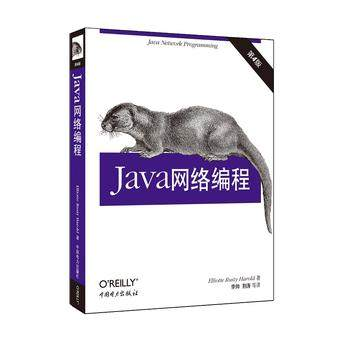

本仓库的笔记整理于《 java 网络编程 》

1. [第一章 基本的网络概念](./chapters/chapter1_base_network_concept.md)

2. [第二章 I/O流](./chapters/chapter2_stream.md)

3. [第三章 线程](./chapters/chapter3_thread.md)

3. [第四章 Internet地址](./chapters/chapter4_InetAddress.md)

3. [第五章 URI和URL](./chapters/chapter5_URL&URI.md)

3. [第六章 HTTP](./chapters/chapter6_http.md)

学习的 [源码](http://www.cafeaulait.org/books/jnp4/examples/index.html) 参考