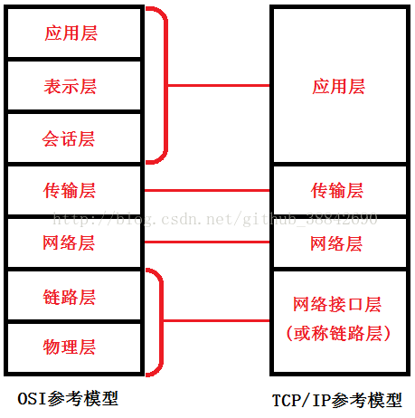
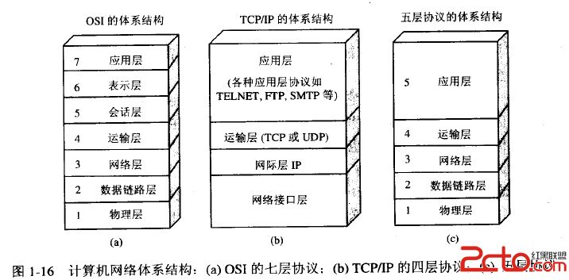
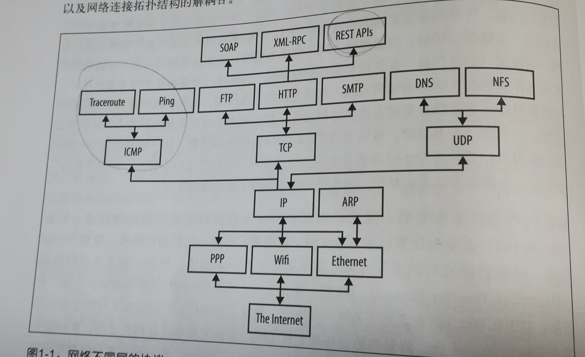
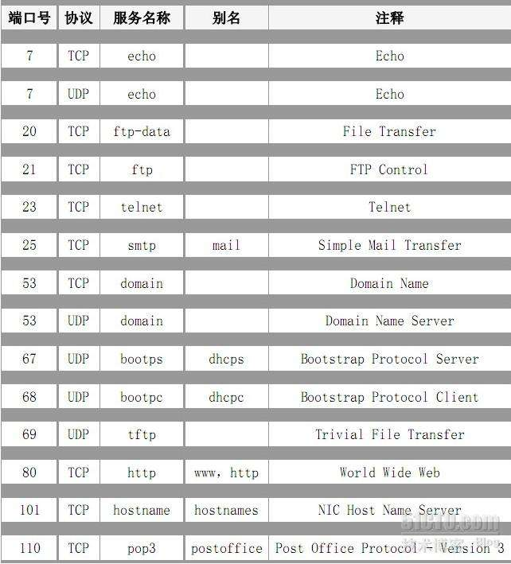

2018年11月01日

## 第一章 基本网络概念

### 一些重要的概念
现代计算机网络都是**包交换**（分组交换）网络：流经网络的数据分割成小块，称为包（packet，也称为分组），每个包都被单独处理，利用率比较高。

> **分组交换，电路交换，报文交换的对比**
> 
> **电路交换**：双方通信的过程中需要建立一个物理的线路连接，当两者建立通信连接之后，一直占用该信道，直到双方通信结束。
> 优点：传输效率快，适合传输量比较大的通信，信道利用比较高，只要一开始建立连接，加上一些首部控制信息之外，后面的一般可以不用加首部等一些不必要的通信控制部分，所以整体的利用率还是比较高的。
> 缺点：占用单独一个信道，建立连接前要确保信道是安全和稳定的，需要支付一定的信道修建费用，如果信道出现问题，双方通信中断。
> **分组交换**：分组交换将整个数据包分成不同的一小块，每一小块加上序号等控制信号，通过路由器的存储转发出去，最后到达想相同的目的地。
> 优点：可以共用不同的信道，如果一个信道出现问题，可以随时更改信道，使得信道利用率更高。
> 缺点：会有一定的时延，每个分块都有控制信息，所以整体的有效信息会降低  
> **报文交换**：报文交换具有分组交换和电路交换的特点，报文交换也电话交换一样，都是不用分组传送的，整个数据包一起发送出去传送，和分组交换类似，也不需要建立物理连接，也是通过存储转发出去的。
> 优点：信道利用率较高
> 缺点：数据比较大，时延等比较大。

### 网络的分层

网络是一个很复杂的网络拓扑结构，为了隐藏网络的复杂性，人们提出不同层次的概念，这样方便不同人员在不同层次上工作，而且只要暴露相应的接口，这样不同层次的人员就可以自己独立的工作，互不影响了。

一般我们采用的是tcp/ip的四层结构，（  5 层结构和 7 层结构一般用于研究比较多，应用比较少。）  

由上图可以得出      
**应用层**是我们常用的 API 等具体应用协议  
**传输层**主要有两个协议，分别是 TCP 协议和 UDP 协议  
**网络层**是 IP 协议， 他是上下两层之间的重要协议  
**网络接口层**是一般我们不需要关注的物理层比较多一些  

**ICMP** 协议主要的应用是 Traceroute 和 Ping ,分别是追踪数据包在不同的路由器之间的路线和测试服务器的连通性    
**TCP** 主要是应用在 FTP（文件传输协议） HTTP（超文本传输协议） SMTP（邮件传输协议）。      
**UDP**主要的应用是 DNS (域名解析协议)  DHCP（Dynamic Host Configuration Protocol，动态主机配置协议）

IPv4 是 32 位/4 字节，IPv6 是 128 位/16 字节，IPv4 采用点分十进制表示，IPv6 采用 ：表示，可以如果 0 是连着的可以缩写，但是只能用一次，比如说 1:1:0:0:1:0:1:1 可以缩写成 1:1:：1:0：1:1

1-1023 是 熟知端口 ，省下的是可分配端口

