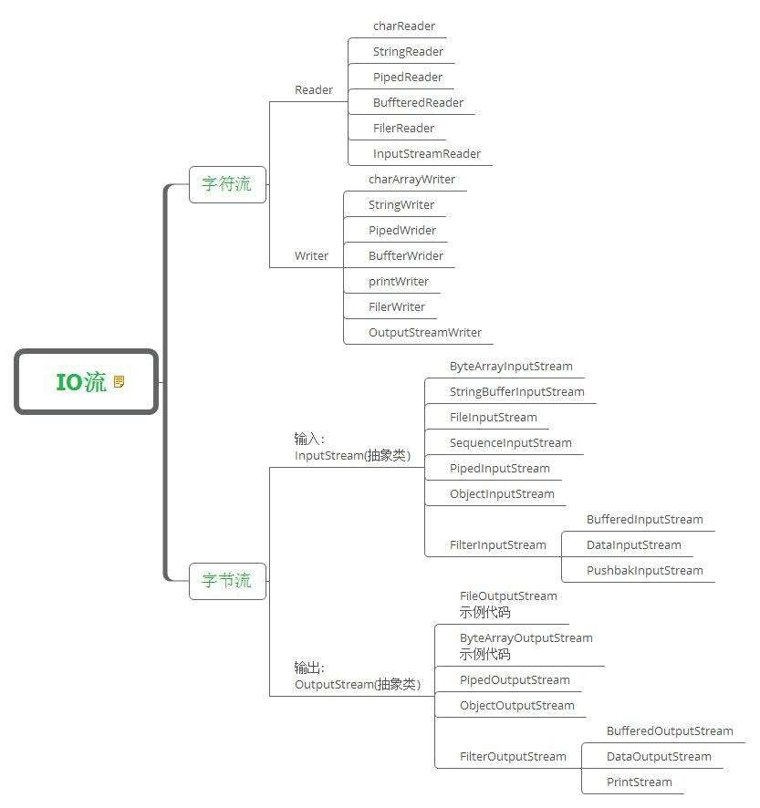

2018年11月02日

## 流

**流是同步** 当程序（确切的讲是线程）一个流读/写一段数据是，在做任何其他操作前，他要等待所读/写的数据和内容。




[TOC]


###  输出流OutputStream

OutputStream 是一个抽象类。

``` java
package java.io;
public abstract class OutputStream implements Closeable, Flushable {
	public abstract void write(int b) throws IOException;
 	public void write(byte b[]) throws IOException{}
	public void write(byte b[], int off, int len) throws IOException {}
	public void flush() throws IOException{}
	public void close() throws IOException {}
 
```
我们可以看到一共有三个重载的 write() 方法，还有一个 flush() 方法和 close() 方法。   
flush（）：flush（）方法可以强迫缓冲的流发送数据，几时缓冲去还没有满，以此来打破等待的状态，只要被 flush 了，就会马上发送数据，但是前提条件是数据要在 close（）方法之前使用。

close（）：close 函数在用在关闭最后的资源链接，一般使用是要判断链接是不是 null 的，如果不是 null 才需要释放他，否则不用处理，因为资源已经关闭了。
**java 7 之后可以使用 try with resource 方法来释放连接等，这样更加简洁，例如       

``` java
 try(OutputStream out= new OutputStream("/temp/data.txt")){      
//处理数据流。。。。。     
} catch (IOException ex){    
//异常处理
}  
```
这样就不用在finally中手动释放连接了，可以自动释放。前提条件是，该类或者该对象实现了 Closeable 接口。
**


### 输入流InputStream
 同样的，InputStream 也是一个抽象类
 
 

``` java
package java.io;
public abstract class InputStream implements Closeable {

// MAX_SKIP_BUFFER_SIZE is used to determine the maximum buffer size to
    // use when skipping.
    private static final int MAX_SKIP_BUFFER_SIZE = 2048;
	
	 public abstract int read() throws IOException;
	 public int read(byte b[]) throws IOException {}
	 public int read(byte b[], int off, int len) throws IOException{}
	 public long skip(long n) throws IOException {}
	 public int available() throws IOException {}
	 public void close() throws IOException{}
	 public synchronized void mark(int readlimit) {}
     public synchronized void reset() throws IOException {}
	 public boolean markSupported(){}
	 }
```
可以发现，三个重载的 read()方法 ：read() 方法会等待且阻碍气候任何代码的运行，只要有1字节的户数可供读取 。如果没有可以读取的就返回 -1         
skip() :选择性的跳过 long   个 字。      
available(): 确定不阻塞的情况下可以读取的字数，返回的是最少的字节数一般来说就是总的字数。      
close()：close 用来关闭资源链接，实现了Closeable,所以可以使用 try with resource 的方法来结束资源.      
mark():用来标记当前的位置，而且有且仅有一个标记，如果标记新的位置时候，旧的标记就会失效。    
reset(): reset 会重置             
markSupported():判断是不是支持标记，如果支持标记的话就返回 true，否则返回false     

### 过滤器流
过滤器流可以使原始的字节和各种格式之间来回转换。    
过滤器有两个版本：**阅读器和书写器（reader && writer)**   


### 缓冲流
主要是  BufferedInputStream 和 BufferedOutputStream

``` java
 public BufferedInputStream(InputStream in) {
        this(in, DEFAULT_BUFFER_SIZE);
    }
	
public BufferedInputStream(InputStream in, int size) {
        super(in);
        if (size <= 0) {
            throw new IllegalArgumentException("Buffer size <= 0");
        }
        buf = new byte[size];
    }
 
 	
  public BufferedOutputStream(OutputStream out) {
        this(out, 8192);
    }
	
public BufferedOutputStream(OutputStream out, int size) {
        super(out);
        if (size <= 0) {
            throw new IllegalArgumentException("Buffer size <= 0");
        }
        buf = new byte[size];
    }
 
```

不同的缓冲流的构造方法都差不多，第一构造方法都是调用第二个构造方法，默认的缓冲区大小都是 8192，第二个构造方法可以自定义缓冲区的大小


### PrintStream 
System.out 其实是一个 PrintStream 对象 

``` java
public class PrintStream extends FilterOutputStream implements Appendable, Closeable{
  
  
   /* Private constructors */
    private PrintStream(boolean autoFlush, OutputStream out) {
        super(out);
        this.autoFlush = autoFlush;
        this.charOut = new OutputStreamWriter(this);
        this.textOut = new BufferedWriter(charOut);
    }
  /* Private constructors */
    private PrintStream(boolean autoFlush, OutputStream out, Charset charset) {
        super(out);
        this.autoFlush = autoFlush;
        this.charOut = new OutputStreamWriter(this, charset);
        this.textOut = new BufferedWriter(charOut);
    }

 /* Private constructors */
    private PrintStream(boolean autoFlush, Charset charset, OutputStream out)
        throws UnsupportedEncodingException
    {
        this(autoFlush, out, charset);
    }


    public PrintStream(OutputStream out) {
        this(out, false);
    }

   
    public PrintStream(OutputStream out, boolean autoFlush) {
        this(autoFlush, requireNonNull(out, "Null output stream"));
    }
	
	}
```

默认情况下，打印应当显示的刷新输出。不过，如果autoFlush 参数为 true ，阿么每次写入 1 字节数组或者换行，或者 调用 println() 时 ，都会刷新输出流。

**使用 PrintStream 慎重**    

1. println()是和平台有关的，windows 系统换行是回车换行两个一起结合使用
2. PrintSteam 是假定所在平台的默认编码方式，比如说，在美国，有可能是使用美国本地化的环境 cp1252 ,在日本有可能是用 SJIS 编码文件，如果两个国家通信，默认是不会修改默认的编码方式的，这样双方传输的文件等就会有问题了。但是 PrintWriter 可以解决这个问题
3. PrintStream 会吞掉所有的异常，一般用于教学演示比较好，不会出错

**PrintWriter用于替代PrintStream**


**网络数据都是采用大端格式的**