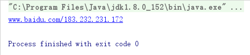
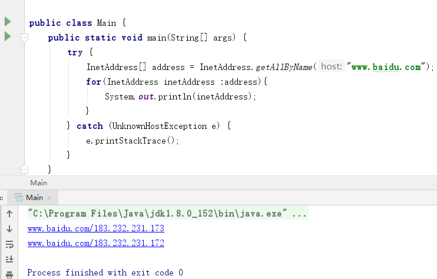
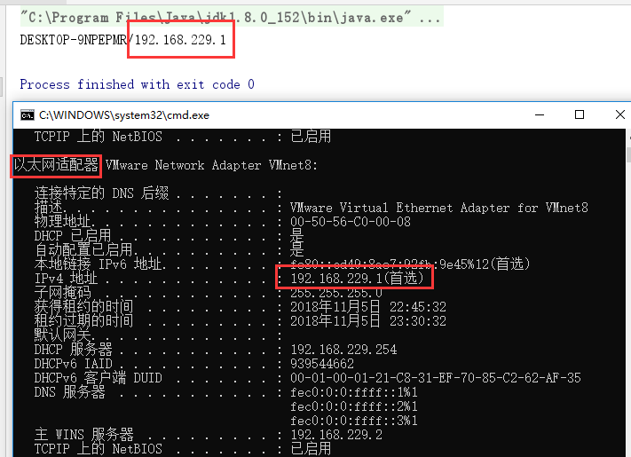
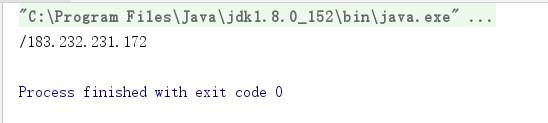
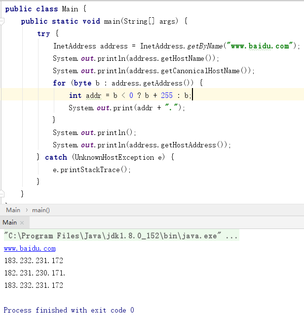
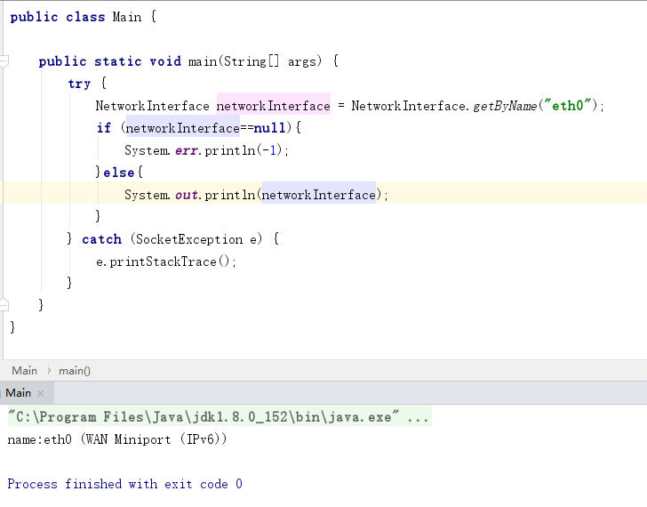
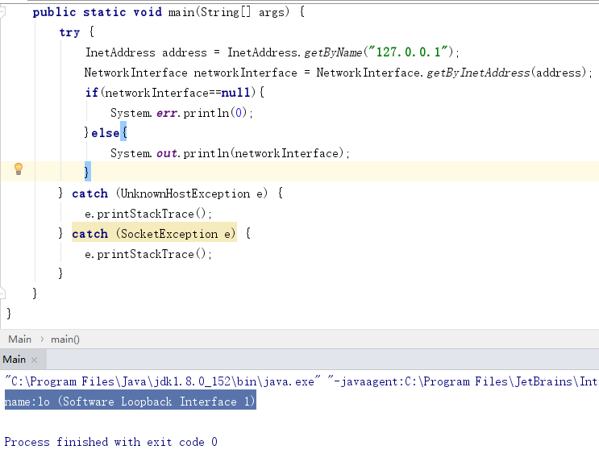
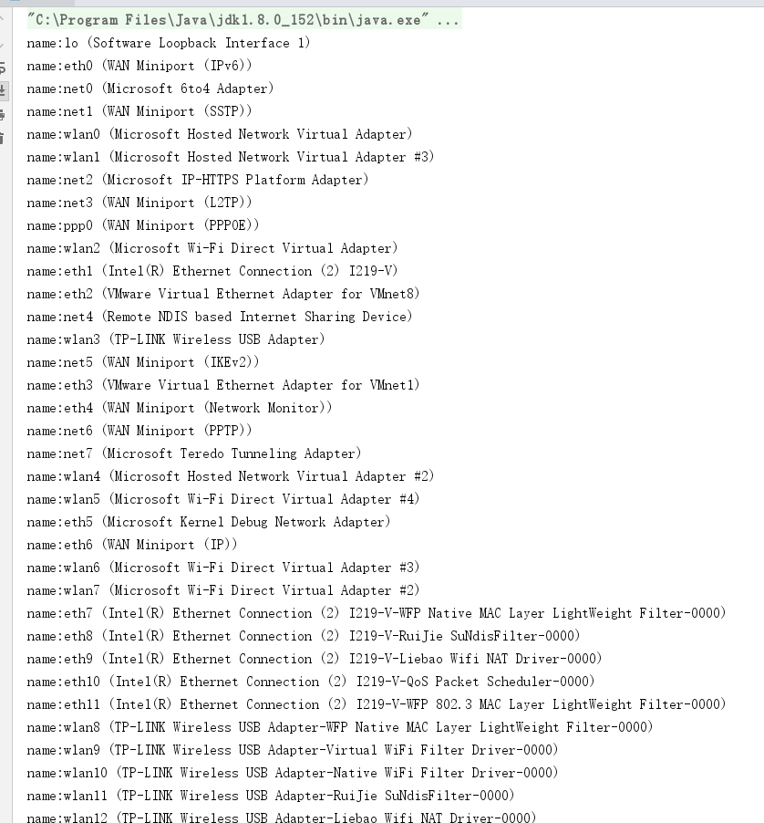

2018年11月05日

## Internet 地址

[toc]

### 定义
用来唯一标识网络中的每一台主机称作 Internet 地址 或者 IP 地址

IP 地址目前可以是 IPv4 或者是 IPv6 的地址，IPv4 地址是 4 个字节，一般用点分十进制进行书写，每一个 部分的取值范围是 0~255 。IPv6 的地址是 16 字节，一般共冒号区分不同的部分，一共 8 个部分， 每一部分用十六进制表示，如果有连续的 0 出现，可以进行省略缩写，比如 0:0:0:0:0:0:0:0 可以缩写为 :: 。在IPv4 和 IPv6的混合网络中，有时候最后的4个字节也可以采用点分十进制表示。

IP的地址的出现可以让人们不用区分不同的异构的网络的细节，更加灵活的将不同的网络连接起来，形成一个巨大的通信网络

### InetAddress 类

java.net.InetAddress类是 java 对 IP 地址（包括 IPv4  和 IPv6）的高层表示。大多数的其他网络类都要用到这个类，包括 Socket 、ServerSocket 、URL 、DatagramSocket 、DatagramPacket 等，一般来说它包括一个主机名和一个 IP 地址。

``` java
public class InetAddress implements java.io.Serializable {
	static final int IPv4 = 1;
	static final int IPv6 = 2;
	static transient boolean preferIPv6Address = false;
	 static class InetAddressHolder {
	 ……
	 }
	 
	 InetAddress() {
        holder = new InetAddressHolder();
    }
	 public boolean isMulticastAddress() {
        return false;
    }
	
	 public boolean isAnyLocalAddress() {
        return false;
    }
	
	 public boolean isAnyLocalAddress() {
        return false;
    }
	
	 public boolean isLinkLocalAddress() {
        return false;
    }
	
	public boolean isSiteLocalAddress() {
        return false;
    }
	
	 public boolean isMCGlobal() {
        return false;
    }
	
	 public boolean isMCNodeLocal() {
        return false;
    }
	
	  public boolean isMCLinkLocal() {
        return false;
    }
	
	 public boolean isMCSiteLocal() {
        return false;
    }
	public boolean isMCOrgLocal() {
        return false;
    }
	
	 public boolean isReachable(int timeout) throws IOException {
        return isReachable(null, 0 , timeout);
    }
	
	 public boolean isReachable(NetworkInterface netif, int ttl,
                               int timeout) throws IOException {
        if (ttl < 0)
            throw new IllegalArgumentException("ttl can't be negative");
        if (timeout < 0)
            throw new IllegalArgumentException("timeout can't be negative");

        return impl.isReachable(this, timeout, netif, ttl);
    }
	public String getHostName() {
        return getHostName(true);
    }
	
	 String getHostName(boolean check) {
        if (holder().getHostName() == null) {
            holder().hostName = InetAddress.getHostFromNameService(this, check);
        }
        return holder().getHostName();
    }
	
	 public String getCanonicalHostName() {
        if (canonicalHostName == null) {
            canonicalHostName =
                InetAddress.getHostFromNameService(this, true);
        }
        return canonicalHostName;
    }
	
	……省略好多
	 
```

1.  **创建 InetAddress 对象**


一般创建一个新的 InetAddress 对象是使用提供的静态方法进行创建的。

``` java
InetAddress address  = InetAddress.getByName("www.baidu.com");
```

实际上它会建立与本地的 DNS 服务器的一个连接，来差查询名字和数字地址（如果之前有查询过，会有缓存），查找不到会排除一个异常  UnknownHostException ，这个异常是 IOException 的一个子类。


demo

``` java
public class Main {
    public static void main(String[] args) {
        try {
            InetAddress address = InetAddress.getByName("www.baidu.com");
            System.out.println(address);
        } catch (UnknownHostException e) {
            e.printStackTrace();
        }
    }
}

```
结果




也可以通过 IP 地址反向查找，比如说通过 IPv4 的地址，查找主机的地址，如果查找到就会返回 主机名 （hostName），否则返回点分十进制的 IP 地址

``` java
InetAddress address = InetAddress.getByName("183.232.231.172"); System.out.println(address.getHostName());
```
结果     
183.232.231.172 

2. 查找所有的主机地址 getAllByName()
通过 getAllByName() 可以列出所有的主机名和 IP 地址




3. **查找当前的主机的主机名和 IP 地址 getLocalHost()**


返回的是当前 以太网的适配器的 IP 地址，可以在控制台中输入 ipconfig/all（windows系统） 或者 ifconfig(Linux系统) 查看一下，结果发现和我们程序测试的是一样的。如果当前没有没有网卡之类的，会返回 localHost 的地址，就是 “127.0.0.1” 

demo

``` java
 public static void main(String[] args) {
        try {
            InetAddress address = InetAddress.getLocalHost();
            System.out.println(address);
        } catch (UnknownHostException e) {
            e.printStackTrace();
        }
    }
```
结果
 
 
 
 4. **构建的 InetAddress 的另一个方法**


 通过getByName()方法一般都会需要和 DNS 交互，但是通过 getByAddress() 就不需要和 DNS 交互了，他可以为不存在或者无法解析的主机构建一个 InetAddress 对象,这个一般用于一些打印机之类的，不需要真正与DNS 交互来知道对应的 IP 地址，或者是主干网的主机的 IP 地址，我们可以直接自己指定或者直接使用 IP 地址就好了，省去DNS 查询的时间。
 
 
 

``` java
 public static InetAddress getByAddress(byte[] addr)  throws UnknownHostException {
        return getByAddress(null, addr);
    }
	
public static InetAddress getByAddress(String host, byte[] addr)  throws UnknownHostException {
        if (host != null && host.length() > 0 && host.charAt(0) == '[') {
            if (host.charAt(host.length()-1) == ']') {
                host = host.substring(1, host.length() -1);
            }
        }
        if (addr != null) {
            if (addr.length == Inet4Address.INADDRSZ) {
                return new Inet4Address(host, addr);
            } else if (addr.length == Inet6Address.INADDRSZ) {
                byte[] newAddr  = IPAddressUtil.convertFromIPv4MappedAddress(addr);
                if (newAddr != null) {
                    return new Inet4Address(host, newAddr);
                } else {
                    return new Inet6Address(host, addr);
                }
            }
        }
        throw new UnknownHostException("addr is of illegal length");
    }
```

Demo 

``` java
 public static void main(String[] args) {
        try {
            byte[] bytes = {(byte)183,(byte)232,(byte)231,(byte)172};
            InetAddress address = InetAddress.getByAddress(bytes);
            System.out.println(address);
        } catch (UnknownHostException e) {
            e.printStackTrace();
        }
    }
```
结果     
直接显示 IP 地址，没有主机号，或者说主机号为空


 
 5.**缓存**

一般 DNS  查询成功之后会将对应的 IP 地址缓存一段时间，方便接下来的使用，但是缓存一般不是永久缓存的，会有一定的缓存期限的。这些时间可用系统的属性 networkaddress.cache.ttl 和 networkaddress .cache.negative.ttl 来控制。其中，第一个属性 networkaddress.cache.ttl 指定了查找成功的 DNS查找结果在 java 缓存中的保留时间（秒数）。networkaddress .cache.negative.ttl 一般用来指定不成功的查找结果的缓存时间（秒数）。在这些时间内，再次查找相同的主机就会返回相同的结果。

6.**按 IP  地址查找**

一般地，如果单纯的使用 getByName() 一般是不会 DNS 解析的，但是请求主机（显示的调用 getHostName()）就会真正的 DNS 查找。我们可以看出，通过 ` System.out.println(address)`,时他是自动查找了getHostName() 和对应的 IP  地址的。

7.**安全性问题**

由于任意的 DNS 查找会泄露信息，所以要禁止任意的 DNS 查找。不可信代码允许调用 InetAddress .getLocalHost()。 不过一般情况下，getLocalHost() 一般是返回主机名 localhost/127.0.01 ，因为服务器一般是在防火墙后面的，所以如果 被暴露了，别人可以通过这个通道 来知道防火墙后面的更多信息。与所有的安全检查一样，禁止 DNS 解析可以对可信代码放宽要求，要测试一个主机能否解析，所用的特定的 SecurityManager 方法是 'checkConnect()'。

当port 参数为-1 时，这个方法检查能否调用 DNS 解析指定的 hostName。（如果 port 参数大于-1，这个方法检查的是否允许在指定的端口对指定的主机建立连接）。hostName canshu 可以是主机名（“www.baidu.com”），也可以是 IP 地址。

8. **获取主机名方法**

``` java
/*获取主机名字*/
    public String getHostName() {
        return getHostName(true);
    }

    String getHostName(boolean check) {
        if (holder().getHostName() == null) {
            holder().hostName = InetAddress.getHostFromNameService(this, check);
        }
        return holder().getHostName();
    }
holder().getHostName();
    }
	
	
	public String getCanonicalHostName() {
        if (canonicalHostName == null) {
            canonicalHostName =
                InetAddress.getHostFromNameService(this, true);
        }
        return canonicalHostName;
    }
	
	-------------------------------------------------------------------------------------
	/*获取 IP 地址*/
	public byte[] getAddress() {
        return null;
    }


  public String getHostAddress() {
        return null;
     }
	
```
查看源码发现，没有对应的 setHostNmae() 和 setAddress（） 方法，这个寿命 java.net 之外的包无法在后台改变 InetAddress 对象的字段。这使得 InetAddress 是线程安全的。



**注意：因为 java中是没有无符号字节的，所以我们通过 `public byte[] getAddress()` 获取的 IP 地址需要处理一下才能转变成 0~255 之间的数字。`int addr = b < 0 ? b + 255 : b;`**


9. **其他方法**

+ public boolean isAnyLocalAddress() /* 通配地址，在 IPv4 的地址中 ，0.0.0.0 是通配地址，在 IPv6 中 ，0:0:0:0:0:0:0:0 是通配地址。通配地址可以匹配本地系统中的任何地址。如果是通配地址就返回true, 否则返回false  */
+ public boolean isLoopbackAddress() /*   如果是本地地址，也就是 localhost，就返回true ，否则返回false，在 IPv4中 回环地址是 127.0.0.1，如果是 IPv6中 ，回环地址是 0:0:0:0:0:0:0:1 ，也写作 ::1 */
+ public boolean isLinkLocalAddress() /*  如果地址是一个 IPv6 本地的链接地址，该方法返回true，否则返回false 。 IPv6 本地链接地址可用于帮助 IPv6网络实现自动配置，与 IPv4 网络上的 DHCP 非常类似，但是没有必要使用服务器。所有本地链接都以 8字节 FE80：0000：0000：0000开头 */ 
+ public boolean isSiteLocalAddress()  /*   如果地址是一个 IPv6 本地网站的地址，isSiteLocalAddress方法返回true ，否则返回false 。一般这种网站只会在本地中使用，不会转发到本地网站以外。本地网站地址以 8字节 FEC0：0000：0000：0000 开头 */ 
+ public boolean isMulticastAddress() /*  如果地址是一个组播地址，返回true ，否则返回false。组播地址会将内容全局广播。在 IPv4 中，组播地址是 D 类地址，在 224.0.0.0~239.255.255.255 ，在 IPv6中，组播地址都以 字节 FE开头 */
+ public boolean isMCGlobal() /*  如果地址是全球组播地址，返回true，否则返回false 。在 IPv6 地址中 ，全球组播地址以 FF0E,FF1E开头  */
+ public boolean isMCOrgLocal() /*    如果是一个组织范围内的组播地址，返回true，否则返回false。 在 IPv6 地址中，组织组播地址以FF08，FF18 开头   */
+ public boolean isMCSiteLocal()  /*  如果地址是一个网站范围内的组播地址，返回true，否则返回false。在 IPv6 地址中，组织组播地址以FF05，FF15 开头   */ 
+ public boolean isMCLinkLocal() /*  如果是子网范围内的组播地址，返回true，否则返回false 。在 IPv6 地址中，组织组播地址以FF02，FF12 开头   */     
+ public boolean isMCNodeLocal() /*   如果是一个本地接口组播地址，返回true，否则返回false。一般用于网络调试或者测试。在 IPv6 地址中，组织组播地址以FF01，FF11 开头  */


10. **测试可达性** 

InetAddress 类有两个 isReachable（）方法，可以用来测试网络是否可达，也就是说网络是否连通的。因为网络拥塞等情况下，如果在指定的时间内可达，说明他们之间是连通的，返回true，否则返回false。

``` java
public boolean isReachable(int timeout) throws IOException {
        return isReachable(null, 0 , timeout);
    }
public boolean isReachable(NetworkInterface netif, int ttl,
                               int timeout) throws IOException {
        if (ttl < 0)
            throw new IllegalArgumentException("ttl can't be negative");
        if (timeout < 0)
            throw new IllegalArgumentException("timeout can't be negative");

        return impl.isReachable(this, timeout, netif, ttl);
    }
```

---------------------

### NetworkInterface 类
NetworkInterface 类表示一个本地 IP 地址。这个可以是一个物理接口，如额外的以太网卡，常见于防火强和路由器，也可以是一个虚拟接口，与机器和其他 IP 地址绑定到统一物理硬件。NetworkInterface tigong 提供了一些方法可以枚举所有本地地址，并由他们穿件 InetAddress 对象这些 InetAddress 对象可用于创建 socket ,服务器 socket 等


NetworkInterface 类中提供了一些静态方法

1.**getByName（）**
返回指定名字的网络接口，如果没有这样的接口就返回 null，
``` java
  public static NetworkInterface getByName(String name) throws SocketException {
        if (name == null)
            throw new NullPointerException();
        return getByName0(name);
    }
	
	private native static NetworkInterface getByName0(String name)   throws SocketException;
```

demo



2.**getByInetAddress（）**
表示与指定 IP 地址绑定的网络接口。如果本地主机上没有网络接口与这个 IP 地址绑定，就返回 null。

``` java
   public static NetworkInterface getByInetAddress(InetAddress addr) throws SocketException {
        if (addr == null) {
            throw new NullPointerException();
        }
        if (!(addr instanceof Inet4Address || addr instanceof Inet6Address)) {
            throw new IllegalArgumentException ("invalid address type");
        }
        return getByInetAddress0(addr);
    }
	
	 private native static NetworkInterface getByInetAddress0(InetAddress addr)   throws SocketException;
```

demo



3. **getNetworkInterfaces()**

列举本机中全部的网络接口。

``` java
public class Main {

    public static void main(String[] args) {
        try {
            Enumeration<NetworkInterface> interfaces = NetworkInterface.getNetworkInterfaces();
            while(interfaces.hasMoreElements()){
                System.out.println(interfaces.nextElement());
            }
        } catch (SocketException e) {
            e.printStackTrace();
        }
    }
}
```
结果



4. **public Enumeration<InetAddress> getInetAddresses() **

返回指定网络接口中绑定的 ip 地址

5. ** public String getName()**

返回指定的 NetworkInterface 的名字

6. **public String getDisplayName()**

返回指定的 NetworkInterface 的一个好听的名字