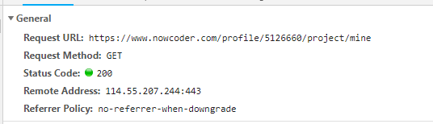
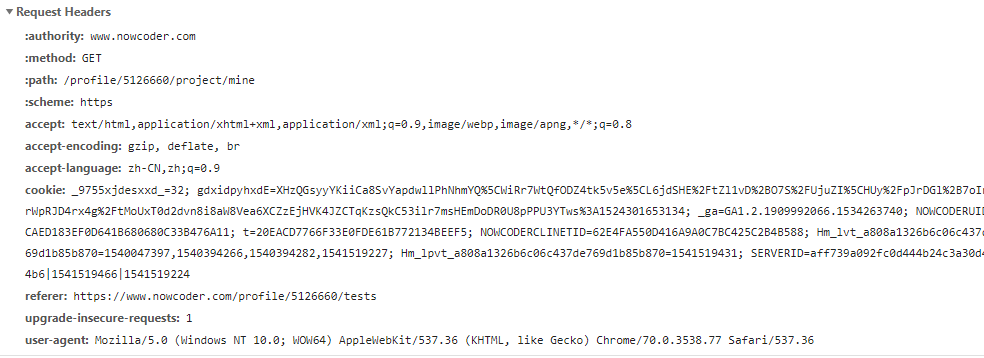
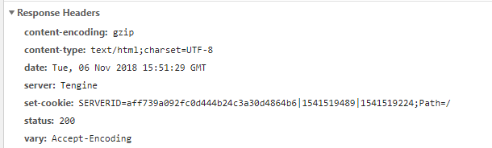
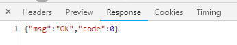
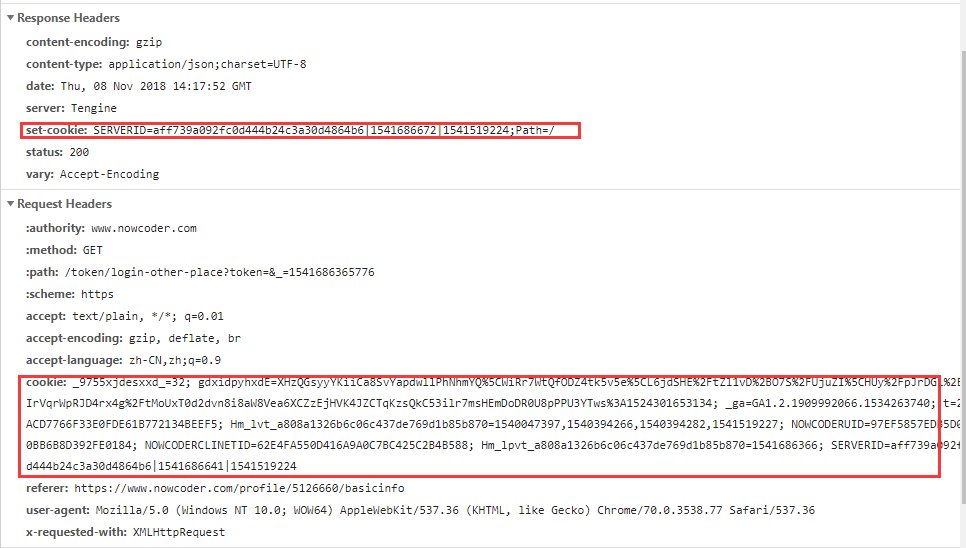

2018年11月06日

## 超文本传输协议 HTTP

[toc]

### 定义

超文本传输协议（ Hypertext Transfer Protocol Http  ） 是一个标准，定义了 web 客户端如何与服务器对话，以及数据如何从服务器传回客户端。HTTP 指定客户端与服务器如何建立连接，客户端如何从服务器请求数据，服务器如何响应请求，以及最后如何关闭连接，。HTTP 使用 TCP/IP 来传输数据。

### 请求步骤

1. 默认情况下，客户端在端口 80 打开与服务器的一个 TCP 连接，url 中还可以显式指定其他端口
2. 客户端向服务器发送消息，请求指定路径上的资源。这个请求包括一个首部，可选地址，还可以有一个空行，后面是请求的数据。
3. 服务器想客户端发送响应。响应一响应吗开头，后面是包含元数据的首部，一个空行以及所请求的文档或者错误信息
4. 服务器关闭连接。

**HTTP对比**
+ http 1.0 每个 tcp 连接使用结束后都会自动断开连接。一个典型的会话中打开和关闭所有连接所花费的时间远远大于实际传输的时间。
+ http 1.1 每个连接可以设置想要的连接时间来实现长连接，Connection: keep-alive,可以不用关闭连接，同样一个 client 可以重复使用同一 socket  进行多次的请求和响应。
+ http 2.0 主要基于 Google 发明的 SPDY 协议，通过首部压缩是，管线传输请求和响应，以及异步连接多路复用，进一步优化了 HTTP 传输。 不过这些优化通常是在传输层完成，具体细节对应用程序员是屏蔽的。

查看网络请求的内容，可以使用在浏览器中按 F12，或者使用一些抓包工具，比如说 Charles 或者 fiddler，都可以查看到具体的首部内容

#### http 首部





一般形式：一个首部行，一个包含其他元素的首部，**一个空行（一般空行表示结束）**     
一般都是以键值对的形式出现。
MIME 分为两级，类型和子类型。类型是概括那种类型的，子类型是说明特定的子类型的。大概分为9种
+ text/* 可读的文本文件
+ image/* 图片文件
+ model/*  3D 模型，比如说 VRML 文件
+ audio/* 声音文件
+ video/* 视频文件
+ application/* 二进制文件
+ message/*  特定的消息类型，比如说 email 消息等
+ multipart/*  表示多个文档或者不同格式的资源的容器
+ 自定义的非标准的类型

#### http 请求参数

常用的是 post 方法和 get 方法，get方法一般是采用拼接在 url 后面的形式携带参数，post 方法一般是提交内容，一般是采用 json 格式或者其他格式。

#### http 响应头部

一般是说明返回响应的时间等信息。



#### http response 内容

一般 body 部分是我们的重点，现在一般返回的是 json 格式居多



### 常见的 HTTP 状态码
状态码 | 含义
:----:|:-----:
1**	|信息，服务器收到请求，需要请求者继续执行操作
2**	|成功，操作被成功接收并处理
3**	|重定向，需要进一步的操作以完成请求
4**	|客户端错误，请求包含语法错误或无法完成请求
5**	|服务器错误，服务器在处理请求的过程中发生了错误


### 常见的 http 方法
方法 | 用途
:----:|:-----:
 get |获取一个资源，参数可以有可无，参数接在 url 后面
 post |请求一个资源，参数在 url 中不可见
 put |将资源上传到指定的 url 路径中,有幂等性
 delete |删除指定 url 的资源文件，有幂等性
 options| 允许客户端徐文服务器如何处理一个指定的资源文件
connet |构建一个通信隧道
head |获取资源的头部，一般不用返回具体的数据，一般用于检测资源文件的最后修改日期等，
trace | 一般用来进行调试 
copy| java 暂不支持
move | java 暂不支持

---------------------------------------

### Cookie
Cookie 一般指某些网站为了辨别用户身份、进行 session 跟踪而储存在用户本地终端上的数据，一般用于购物车内容，登录平局，用户首选项等。cookie 值只能是非空白的 ASCII 文本 ，不能包含逗号和分号。cookie 可以设置多个。cookie 的作用域还受到路径的限制，可以将这个 cookie 限制在某个路径下。cookie 也可以设置 生存时间，超过指定的时间后就可以浏览器可以清除。

因为 cookie 可能包含敏感的信息，如口令和会阿虎秘钥，所以一些 cookie 事务应当 是安全的。大多数情况下，这意味着使用 HTTPS  替代 HTTP 不论表示什么，每个 cookie 都有一个没有值的 secure 属性。浏览器应该拒绝通过分安全通道发送这种 cookie。



### CookieManager
java 5 包括一个抽象类  java.net.CookieHandler ,他定义了存储和获取 cookie 的一个 API，但是不包括这个抽象类的实现。java 6  进一步补充， 为 CookieHandler 增加了一个可以使用的具体子类 java.net.CookieManager 。
使用的demo
``` java
CookieManager manager = new CookieManager();
CookieHandler.setDefault(manager)
```
通过这个两个方法就可以实现存储这些 cookie ，在后续的请求中可以取出发回给服务器端。如果谨慎使用，还可以通过制定一个 CookiePolicy 来做到。他已经预定义了3个策略。
+ CookiePolicy.ACCEPT_ALL 接受所有的 cookie
+ CookiePolicy.ACCEPT_NONE  不接受任何 cookie
+ CookiePolicy.ACCEPT_ORIGINAL_SERVER 只接受第一方的 cookie


``` java
CookieManager manager = new CookieManager();
manager.setCookiePolicy(CookiePolicy.ACCEPT_ALL)
CookieHandler.setDefault(manager);
```

还可以自定义接受特定的 cookie ，只要重写下面的方法就可以了

``` java
 public boolean shouldAccept(URI uri, HttpCookie cookie);
```

### CookieStore

一般浏览器被动关闭之后，缓存的 cookie 也会被删除，但是为了方便下次继续使用，最保险的方法还是存储在本地磁盘上。下次再启动的时候，在加载这些 cookie ，可以用 getCookieStore() 方法获取这个 cookie 库。使用方法

``` java
CookieStore store = manager .getCookieStore()
```
 具体的 CookieStore 类允许你增加，删除，列举 cookies 
``` java
public interface CookieStore {
 public void add(URI uri, HttpCookie cookie);
 public List<HttpCookie> get(URI uri);	
 public List<HttpCookie> getCookies();
 public List<URI> getURIs();
 public boolean remove(URI uri, HttpCookie cookie);
 public boolean removeAll();
 }
```

具体应用类请参看 **HTTPCookie 类**

### 参考资料
+ [《HTTP状态码详解》](http://tool.oschina.net/commons?type=5)
+ [《HTTP状态码--百度百科》](https://baike.baidu.com/item/HTTP%E7%8A%B6%E6%80%81%E7%A0%81/5053660?fr=aladdin)
+ [《HTTP状态码--菜鸟教程》](http://www.runoob.com/http/http-status-codes.html)